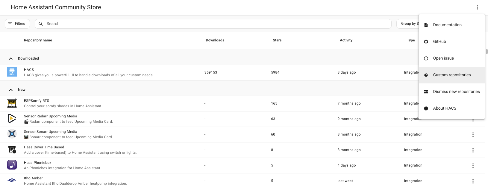
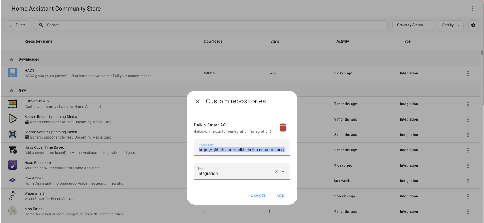

A integração **Daikin Smart AC** permite que o Home Assistant controle sistemas de ar-condicionado inteligentes da Daikin.

## Hardware Suportado

Esta integração do Home Assistant suporta a versão brasileira dos produtos Daikin Smart AC, que são operados pelos aplicativos móveis **Daikin Smart AC** disponíveis nas seguintes plataformas:

- [iOS](https://apps.apple.com/br/app/daikin-smart-ac/id1557849398)
- [Android](https://play.google.com/store/apps/details?id=in.co.iotalabs.dmb.smartac)
  
## Pré-requisitos
  
- O dispositivo de ar-condicionado Daikin já deve estar adicionado à sua conta utilizando o aplicativo móvel Daikin Smart AC.
- A integração requer uma **Chave do Dispositivo**. Para recuperar a Chave do Dispositivo para o SSID (exibido na interface de configuração do Home Assistant durante a configuração), abra o aplicativo móvel Daikin Smart AC, navegue até **Menu -> Integrations -> Home Assistant**, insira ou selecione o SSID e pressione **Submit**.

## Instalação

1. Baixe-o via HACS
2. Reinicie o Home Assistant
3. Na interface do HA:
    - Vá em "Configurações" -> "Dispositivos & Serviços" -> "Integrações", clique em "+" e procure por "**Daikin Smart AC**"
4. Se "**Daikin Smart AC**" não estiver disponível, adicione-o manualmente conforme mostrado abaixo:

## Configuração

Para adicionar a integração **Daikin Smart AC** à sua instância do Home Assistant, utilize o seguinte botão:

O Daikin Smart AC pode ser **descoberto automaticamente** pelo Home Assistant. Se uma instância for encontrada, ela será exibida como **Dispositivo Detectado: DAIKINXXXXXX**. Você poderá então clicar em `ADD` e seguir as instruções na tela para configurá-lo.

Se não for detectado automaticamente, você pode configurar a integração manualmente:
- Acesse sua instância do Home Assistant.
- Vá em Configurações -> Dispositivos & Serviços.
- No canto inferior direito, selecione o botão Adicionar Integração.
- Na lista, selecione Daikin Smart AC.
- Siga as instruções na tela para concluir a configuração.

### Nota:

Se sua unidade Daikin Smart AC não estiver na mesma rede que sua instância do Home Assistant (por exemplo, se sua rede estiver segmentada), a **descoberta automática do dispositivo** pode não funcionar. Nesse caso, você precisará encontrar manualmente o IP do dispositivo, acessando a página de configuração do seu roteador e localizando o IP do cliente para o dispositivo Daikin Smart AC (formato do hostname: DAIKINXXXXXX).

**Para configurar o dispositivo, certifique-se de que as seguintes portas estejam acessíveis:**

- Do Home Assistant para o dispositivo Daikin Smart AC: `TCP Port` => `15914`
- Porta mDNS padrão

Se isso se aplicar à sua configuração, ajuste as configurações do seu firewall para permitir o acesso às portas necessárias.

## Clima

A plataforma de climatização `daikin_br` integra os sistemas de ar-condicionado Daikin com o Home Assistant, permitindo o controle dos seguintes parâmetros:

- [**Modo HVAC**](https://www.home-assistant.io/integrations/climate/#action-climateset_hvac_mode) (`off`, `heat`, `cool`, `dry`, `fan_only`)
- [**Temperatura Alvo**](https://www.home-assistant.io/integrations/climate#action-climateset_temperature)
- [**Modo Ventilador**](https://www.home-assistant.io/integrations/climate#action-climateset_fan_mode) (velocidade do ventilador)
- [**Modo Oscilação**](https://www.home-assistant.io/integrations/climate#action-climateset_swing_mode)
- [**Modo Predefinido**](https://www.home-assistant.io/integrations/climate#action-climateset_preset_mode) (eco, boost)

A temperatura ambiente atual também é exibida.

## Atualizações de Dados

A integração obtém dados do dispositivo a cada 10 segundos, por padrão. 
Recomenda-se não reduzir o tempo de consulta para menos de 10 segundos. Para os usuários que desejam definir seu próprio intervalo de consulta personalizado, eles podem [configurar um intervalo de consulta personalizado](https://www.home-assistant.io/common-tasks/general/#defining-a-custom-polling-interval).

## Limitações Conhecidas

Não há limitações conhecidas para esta integração.

## Solução de Problemas

Não há problemas comuns conhecidos com esta integração.

## Removendo a Integração

Esta integração segue o procedimento padrão de remoção de integrações. Nenhuma etapa adicional é necessária. Consulte [Removendo uma instância de integração](https://www.home-assistant.io/common-tasks/general/#removing-an-integration-instance) para mais detalhes.
1. No Home Assistant, vá para [**Configurações -> Dispositivos & Serviços**](https://my.home-assistant.io/redirect/integrations/).
2. Selecione a integração **Daikin Smart AC** e, no menu de três pontos (⋮), escolha **Excluir**.
3. [Reinicie o Home Assistant](https://www.home-assistant.io/docs/configuration/#reloading-the-configuration-to-apply-changes).

## Contribuições são bem-vindas!

Se você deseja contribuir para este projeto, por favor, leia as [Diretrizes de Contribuição](CONTRIBUTING.md).

***
